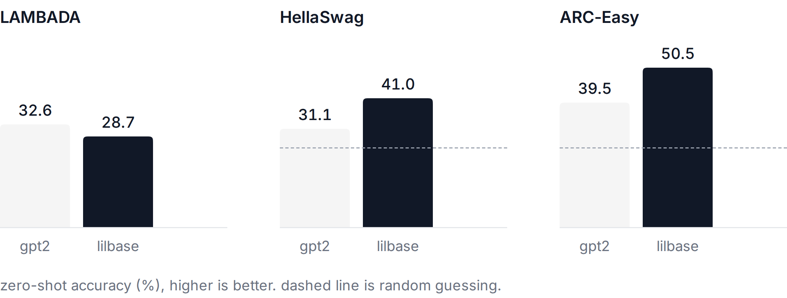

# lilbase (tpu)

a 297m param llama-style model trained from scratch on a kaggle tpu v5e-8.

## try it

it's on ollama: https://ollama.com/navthings/lilbase

```
ollama run navthings/lilbase "The water cycle begins when"
```


## examples

**some text generated by the model:**

The heart is a muscular organ that has two lobes, one on the right side and one on the left. It pumps blood into the body by way of the arteries. The right side is connected to the lungs and the left side connects with the heart. The heart contains two main chambers, the ventricles (smaller) and the mitral valve (large).

Here are some tips for studying effectively:

1. Keep your schedule. If you're not sure how to study effectively, remember that studying is a mental exercise. Take some time off, relax and be more organized.
2. Use flash cards. Using flash cards can help you to study better.
3. Study early in the day. So you should try to study before you have any breakfast.

## what it is

gqa, rope, rmsnorm, swiglu. 24 layers, d=1024, 16 query heads, 4 kv heads. llama tokenizer, 32k vocab. 6.1b tokens of fineweb-edu (sample-10BT), which is roughly chinchilla-optimal for this size.

11,634 steps of 524,288 tokens each, data parallel over all 8 chips. bf16 matmuls, and fp32 sometimes

## vs gpt-2



| | gpt2 (124m) | lilbase (297m) |
|---|---|---|
| lambada acc | 32.6% | 28.7% |
| hellaswag acc_norm | 31.1% | 41.0% |
| arc-easy acc_norm | 39.5% | 50.5% |

zero-shot, lm-eval style scoring (`eval/compare.py`). gpt-2 numbers are the published lm-eval ones, lilbase ran on my mac on subsets (1000 lambada, 400 hellaswag, 400 arc-easy) so give it a couple points either way.

wins hellaswag and arc-easy by ~10 points, loses lambada. makes sense, fineweb-edu is mostly educational text and lambada is novels. also gpt-2 saw way less data per param so this isnt a fair fight, just a fun one.

## running it

reccomend running on kaggle, just import the notebook (in the repo) and change the accelerator to tpu, then save and run all

or heres the link to the kaggle notebook

https://www.kaggle.com/code/navneetdagdiya/base-tpu-kaggle

or paste it into a script kernel and hit save version -> save & run all.

it refuses to start if jax sees anything other than 8 tpu chips. kaggle sometimes hands out a broken allocation with 1 chip. restart and try again rather than training at 1/8th speed without noticing.


## knobs

all at the top of the file. some important ones:

- `BS, GRAD_ACC`: 8x8. 16x4 ran out of hbm by about 400mb. if it overflows on first compile anyway, it halves the micro-batch and retries on its own.
- `MAX_HOURS`: 8.4. lower it if checkpoint saves start getting cut close.
- `LR`: 4e-4. gpt-3 350m used 3e-4 at a similar batch size, so this is slightly optimistic.
- `SAVE_EVERY`: 500 steps.
  
also try changing the end print statements to test the end model with different prompts

## logs

every 50 steps (`PRINT_EVERY`) prints the mean loss over those steps. every 250 steps (`STATS_EVERY`) that line also shows grad norm, lr, tok/s, eta, host ram, hbm peak and `q`. if `q` sits near 0, tokenization is the bottleneck and the tpu is waiting on the cpu.

## requirements

if you somehow have a 8 core tpu, and are running from scratch, install `tpu/requirements.txt` and run `tpu/lilbase.py`. otherwise kaggle all the dependencies downloaded for you
